 

<table align="center">
<tr>
<td colspan="2" align="center">🔴 &nbsp; 🟡 &nbsp; 🟢 &nbsp;&nbsp; <code>codedbyminjae@github: ~/profile --live</code></td>
</tr>
<tr>
<td width="38%" align="center" valign="middle"></td>
<td width="62%" align="center" valign="middle">  &nbsp;&nbsp;</td>
</tr>
</table>
